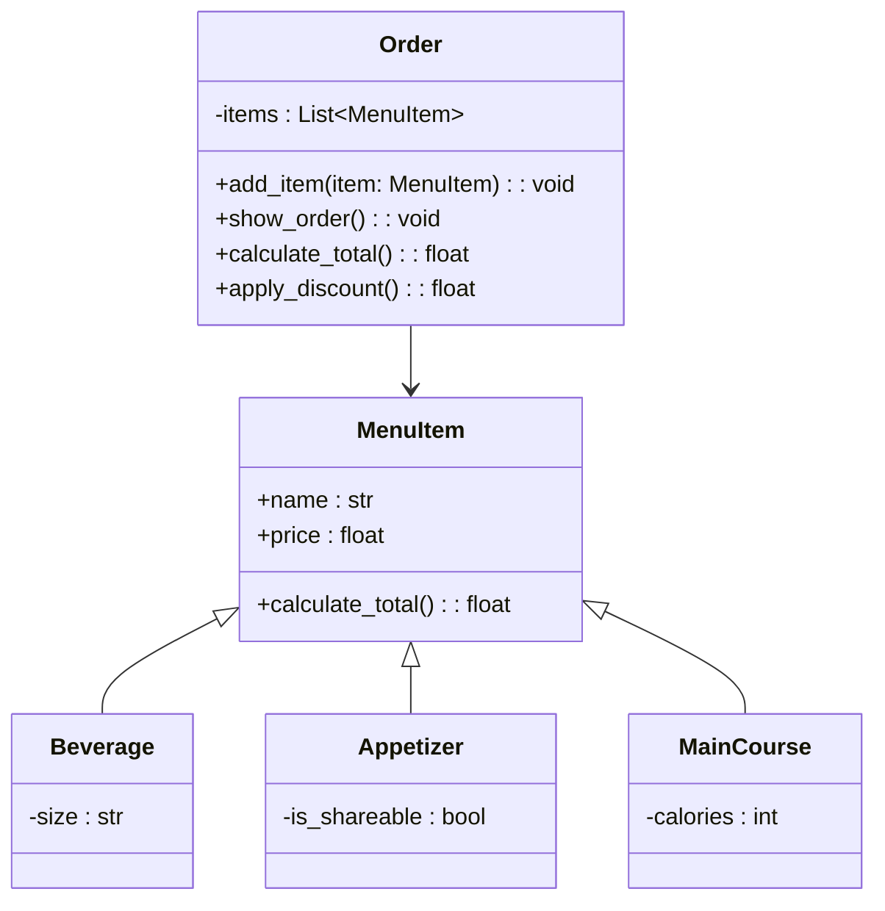

# RETO-3

# Sistema de Pedidos de Restaurante

## Descripción

El programa simula un sistema de pedidos en un restaurante mediante el uso de un menú predefinido y una interacción sencilla con el usuario por consola.

## Funcionamiento del programa

### Menú de productos

Inicialmente, se define un conjunto de productos organizados en una lista llamada `menu`, donde cada elemento representa un producto disponible con su nombre, precio y una característica adicional según su tipo.

Esta lista funciona como la base del sistema, ya que de allí el usuario selecciona los productos que desea agregar a su pedido.

### Gestión del pedido

Para gestionar el pedido, se utiliza una instancia de la clase `Order`, la cual almacena los productos seleccionados en una lista interna.

A través del método `add_item`, el usuario puede ir agregando productos uno por uno según su elección.

### Interacción con el usuario

El programa utiliza un ciclo `while` para mantener activa la interacción con el usuario.

En cada iteración, se muestra el menú con los productos numerados y se presentan tres opciones:

- Agregar un producto  
- Visualizar el pedido actual  
- Finalizar la compra  

Esto permite que el usuario construya su pedido de manera progresiva y tenga control sobre lo que ha seleccionado.

### Visualización del pedido

Cuando el usuario decide ver su pedido, el método `show_order` muestra de forma organizada los productos agregados junto con su precio.

### Cálculo del total y descuentos

El cálculo del total se realiza mediante el método `calculate_total`, el cual recorre todos los productos del pedido y suma sus precios.

Posteriormente, el método `apply_discount` evalúa ciertas condiciones para aplicar descuentos:

- Según el valor total del pedido  
- Según la cantidad de productos  

### Descuentos aplicados

El programa aplica descuentos automáticos según las siguientes condiciones:

- Si el total del pedido es mayor a 50, se aplica un descuento del 15%.
- Si el total del pedido es mayor a 30, se aplica un descuento del 5%.
- Si el pedido tiene 5 o más productos, se aplica un descuento del 10%.

Nota: Solo se aplica un descuento, dependiendo de la condición que se cumpla.  
### Resultado final

Finalmente, al terminar la interacción, el programa muestra un resumen del pedido junto con:

- Total original  
- Total con descuento  

Esto permite al usuario visualizar claramente el resultado de su compra.

---

